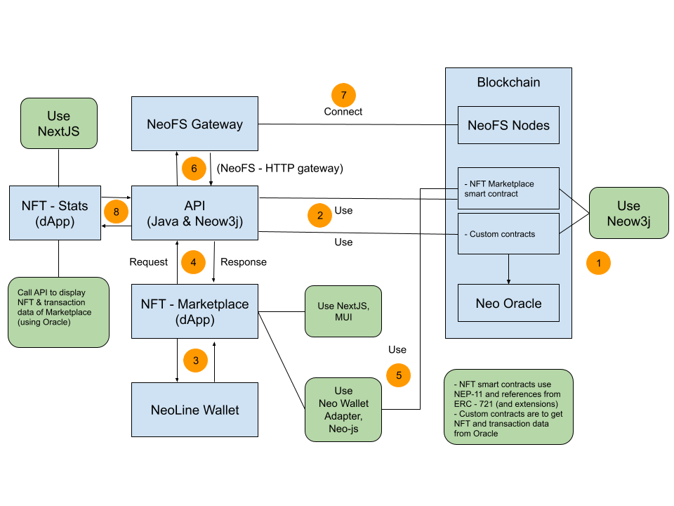
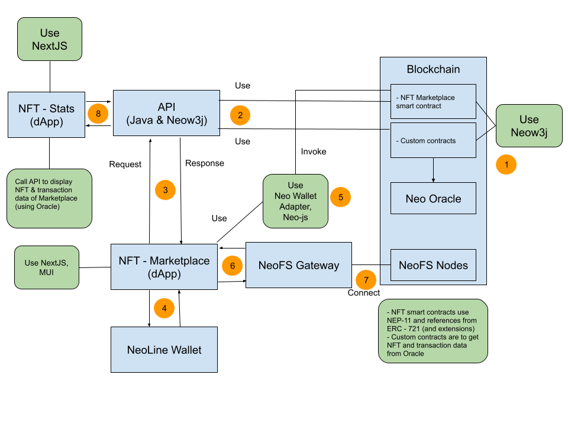

# General Info
Neo-artistic.com is a NFT marketplace on NEO N3 Blockchain. This project includes folders:

- Neo-artistic-api: 
  - End-points: [neo-api.neo-artistic.com](https://neo-api.neo-artistic.com)
  - Handle & manipulate data returned from Smart Contracts. 
  - Provide REST APIs for dApp to get structured data.
  - Use [Java (1.8)](https://www.oracle.com/java/technologies/javase/javase8-archive-downloads.html), [Neow3j (3.16)](https://neow3j.io/#/), [Spring Boot (2.5.13)](https://start.spring.io/) with Maven build tool.

- Neo-artistic-front-page: 
  - Website: [neo-artistic.com](http://neo-artistic.com/)
  - Display NFTs
  - Sell & buy NFTs
  - Add auctions & accept auctions
  - Connect with [NeoLine wallet](https://neoline.io/en/)
  - Integrate with [NeoFS](https://fs.neo.org/)
  - Use [NextJS (11)](https://nextjs.org/), [Material UI](https://mui.com/)
  - Use [Google Protobuf](https://www.npmjs.com/package/google-protobuf), [gRpc-web](https://www.npmjs.com/package/grpc-web)
  - Use [neon-js](https://www.npmjs.com/package/@cityofzion/neon-js), [neo-wallet-adapter](https://github.com/rentfuse-labs/neo-wallet-adapter)
- Neo-artistic-smart-contracts:
  - Include smart contracts for NFT and Oracle
  - BSS.NeoArtistic.NFTMarket: smart contract for NFT marketplace
  - Bss.neo.BinanceManagerContract: smart contract to get price from Binance public api, using Neo Oracle Service
  - Bss.neo.ProviderManagerContract: smart contract for registering multiple price source, but it is not ready and still testing phase
  - Use 100% [Neow3j (3.16)](https://neow3j.io/#/)
- Neo-artistic-stats-dapp:
  - Website: [stats.neo-artistic.com](https://stats.neo-artistic.com/)
  - Display reports & statistics of NFT marketplace
  - Use [NextJS (11)](https://nextjs.org/), [Material UI](https://mui.com/)

# System Diagram
The beginning idea was changed because there were some technical issues. So we will show both old & new system diagram

- Old diagram: 
- New diagram: 

####First difference comes from connections with the NEOFS system. There are reasons:
- Our api uses Java while NEOFS supports Go/C#.
- User must upload file and mint NFT in one action. If we use other APIs from backend, that process becomes complicated more than needed.
- We want to upload/download file on the web-app directly.
####Second difference comes from invoking smart contracts. There are reasons:
- Some transactions must be done with connected wallet, so they should be done from web-app instead of APIs.
- APIs need some credential information to do transactions, but we will get security issues if we send some credential information to API.

####The new diagram is selected to explain how the system works.
