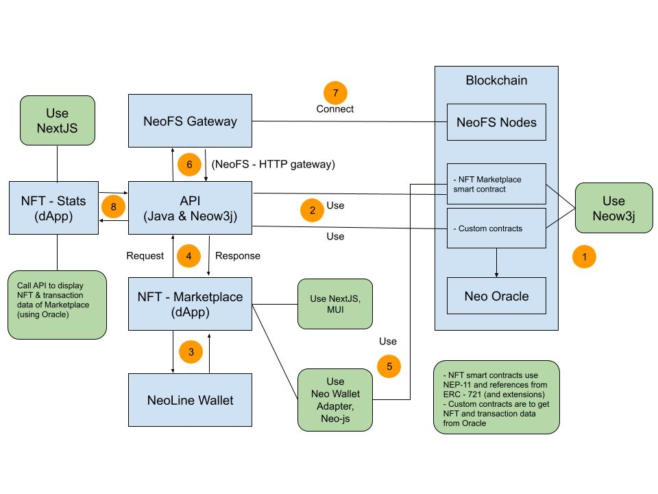
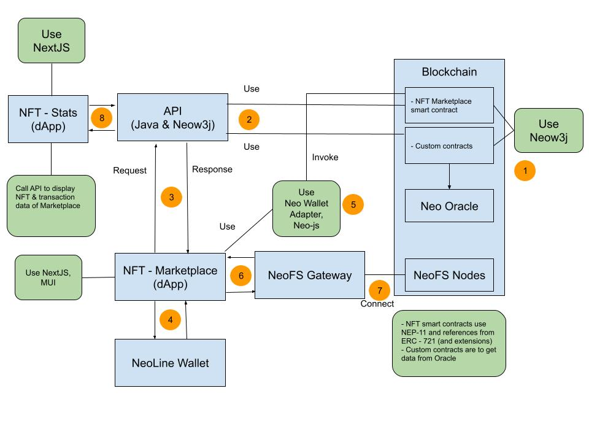
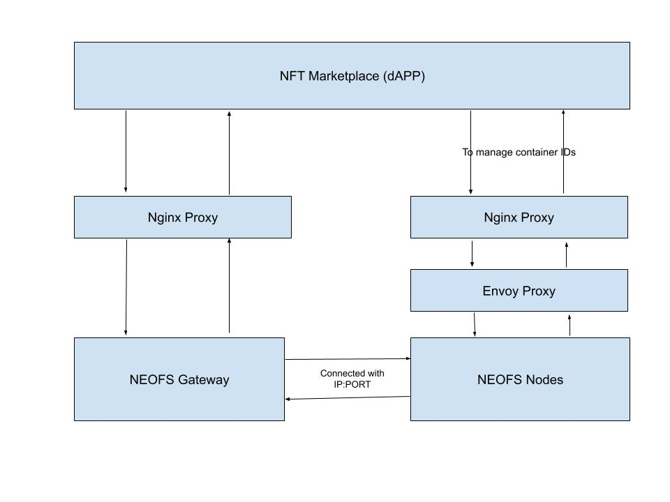
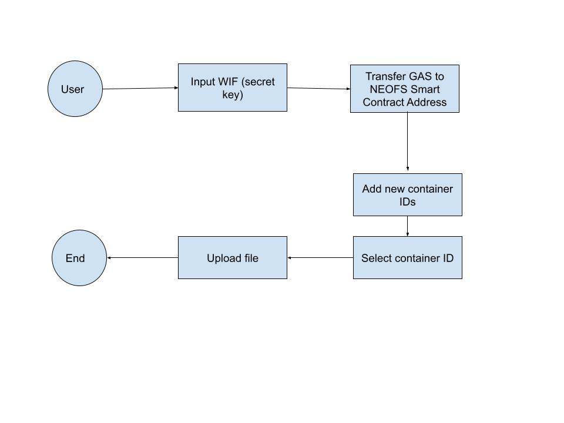

# General Info
Neo-artistic.com is a NFT marketplace on NEO N3 Blockchain. This project includes folders:

- Neo-artistic-api: 
  - End-points: [neo-api.neo-artistic.com](https://neo-api.neo-artistic.com)
  - Handle & manipulate data returned from Smart Contracts. 
  - Provide REST APIs for dApp to get structured data.
  - Use [Java (1.8)](https://www.oracle.com/java/technologies/javase/javase8-archive-downloads.html), [Neow3j (3.16)](https://neow3j.io/#/), [Spring Boot (2.5.13)](https://start.spring.io/) with Maven build tool.

- Neo-artistic-front-page: 
  - Website: [neo-artistic.com](http://neo-artistic.com/)
  - Display NFTs
  - Sell & buy NFTs
  - Add auctions & accept auctions
  - Connect with [NeoLine wallet](https://neoline.io/en/)
  - Integrate with [NeoFS](https://fs.neo.org/)
  - Use [NextJS (11)](https://nextjs.org/), [Material UI](https://mui.com/)
  - Use [Google Protobuf](https://www.npmjs.com/package/google-protobuf), [gRpc-web](https://www.npmjs.com/package/grpc-web)
  - Use [neon-js](https://www.npmjs.com/package/@cityofzion/neon-js), [neo-wallet-adapter](https://github.com/rentfuse-labs/neo-wallet-adapter)
- Neo-artistic-smart-contracts:
  - Include smart contracts for NFT and Oracle
  - BSS.NeoArtistic.NFTMarket: smart contract for NFT marketplace
  - Bss.neo.BinanceManagerContract: smart contract to get price from Binance public api, using Neo Oracle Service
  - Bss.neo.ProviderManagerContract: smart contract for registering multiple price source, but it is not ready and still testing phase
  - Use 100% [Neow3j (3.16)](https://neow3j.io/#/)
- Neo-artistic-stats-dapp:
  - Website: [stats.neo-artistic.com](https://stats.neo-artistic.com/)
  - Display reports & statistics of NFT marketplace
  - Use [NextJS (11)](https://nextjs.org/), [Material UI](https://mui.com/)

# System Diagram
The beginning idea was changed because there were some technical issues. So we will show both old & new system diagram

- Old diagram: 
- New diagram: 

#### First difference comes from connections with the NEOFS system. There are reasons:
- Our api uses Java while NEOFS supports Go/C#.
- User must upload file and mint NFT in one action. If we use other APIs from backend, that process becomes complicated more than needed.
- We want to upload/download file on the web-app directly.

#### Second difference comes from invoking smart contracts. There are reasons:
- Some transactions must be done with connected wallet, so they should be done from web-app instead of APIs.
- APIs need some credential information to do transactions, but we will get security issues if we send some credential information to API.

#### The new diagram is selected to explain how the system works.
- 1 - Smart Contracts using Neow3j library:
  - BSS.NeoArtistic.NFTMarket: smart contract for NFT marketplace
  - Bss.neo.BinanceManagerContract: smart contract to get price from Binance public api
- 2 - Restful APIs to get data from Blockchain via smart contracts:
  - List all NFTs: returned data will be converted to List<NFTToken> 
  - Get NFTs of a wallet address: returned data will be converted to List<NFTToken>
  - Get a NFT properties: returned data will be converted to NFTToken
  - Get NEO-USDT price via Oracle smart contract (Bss.neo.BinanceManagerContract)
- 3 - NFT Marketplace requests data from Restful API endpoints
  - /tokens: get all NFTs.
  - /tokens-of: get NFTs of a wallet address.
  - /neo-price: get NEO in USDT
  - /get-token-by-id: get NFT by id
  - All returned data is JSON format.
- 4 - NFT Marketplace connect to NeoLine wallet
  - To mint NFT
  - To add NFT auctions
  - To change NFT price & royalty
  - To accept auction & start transaction.
- 5 - NFT Marketplace use NEO-WALLET adapter & NEO-JS library
  - To connect with NeoLine
  - To invoke function from smart contracts
- 6 - NFT Marketplace connect to NEOFS Gateway
  - Use upload/<container_id> to upload file to container Id
  - Use get/<container_id>/<object_id> to get file
  - NEOFS Gateway domain: [neo-fs.bsscommerce.com](https://neo-fs.bsscommerce.com)
- 7 - NEOFS NODE provides gRPC endpoints
  - To connect with NeoFS gateway
  - To create container from web-app via web-gRPC
  - NEOFS NODE with Envoy Proxy: [neo-fs-rpc.neo-artistic.com](https://neo-fs-rpc.neo-artistic.com)
- 8 - Stats dAPP get data from Restful API
  - Get NFTs data to analyze

This is a simple diagram show how dAPP and NEOFS works together:

You can try to create your own container ID and upload testing files at here: [https://neo-artistic.com/upload](https://neo-artistic.com/upload)

NEOFS Contract Address is `NadZ8YfvkddivcFFkztZgfwxZyKf1acpRF`

_To make minting NFT process easy, dApp doesn't require transfer GAS or create container ID. dApp uses default account!._

# NFT Marketplace Reference Implementation
- [Neow3j library](https://neow3j.io/#/)
- [NEP-11 Tutorial](https://developers.neo.org/tutorials/neow3j-nep11)
- [Oracle Implementation](https://github.com/neow3j/neow3j-examples-java/tree/master/src/main/java/io/neow3j/examples/contractdevelopment/contracts)
- [Neo Wallet Adapter](https://github.com/rentfuse-labs/neo-wallet-adapter)
- [NeoLine for N3](https://neoline.io/dapi/N3.html)
- [NeoFS demo (not up to date)](https://github.com/CityOfZion/neofs-demo/)
- [NeoFS HTTP Gateway](https://github.com/nspcc-dev/neofs-http-gw)
- [NeoFS Node](https://github.com/nspcc-dev/neofs-node)
- [NeoFs API](https://github.com/nspcc-dev/neofs-api)
- [gRPC-Web](https://github.com/grpc/grpc-web)
- [gRPC-web and protoc plugin to generate JS from .proto](https://github.com/grpc/grpc-web/releases)

# Progress:
- [x] NFT & Market smart contracts following NEP-11
- [x] demo pay out royalties (FTs and NEO)
- [x] test and determine standards for markets (best practice?) to buy/sell NFTs (finish standard) with FTs (already standard)
- [x] demo some basic auction types
- [x] frontend with MUI (Material Design - React UI components )
- [x] first pass / internal audit
- [x] integrate with NeoFS IPFS
- [x] integrate with Binance open API - convert NEO to USD
- [x] use MongoDB to store extra profile data such as profile name, collection, banner, logo...
- [x] implement simple collection feature: each near wallet account has a collection name.
- [x] show collections & NFTs on home page
- [x] show related NFTs item on NFT detailed page.
- [ ] NFT DEFI with landing, borrow and staking.
- [ ] implement NFT portal switch between chains (NEO, NEAR, Aurora, XRP, Ethereum...)
- [ ] connect with bridged tokens e.g. buy and sell with wETH/nDAI (or whatever we call these)

# Tech Stack
- [NextJS 11](https://nextjs.org/)
- [Mongo Atlas](https://www.mongodb.com/atlas/database)
- [MUI](https://mui.com/)
- [Java - Neow3j library](https://neow3j.io/#/)
- [Java - Spring Boot]((https://start.spring.io/))
- [Neo Wallet Adapter](https://github.com/rentfuse-labs/neo-wallet-adapter)
- [gRPC-Web](https://github.com/grpc/grpc-web)
- [NeoFS](https://fs.neo.org/)

# Installation
## NeoFS
### NeoFS HTTP gateway
### NeoFS gRPC node
### Envoy proxy
## NEO tools
### CLI
### GUI
# Working
## Smart contracts
### NFT marketplace contract
### Oracle Contract
## Restful API
## NFT marketplace frontpage
## NFT marketplace statistic page

